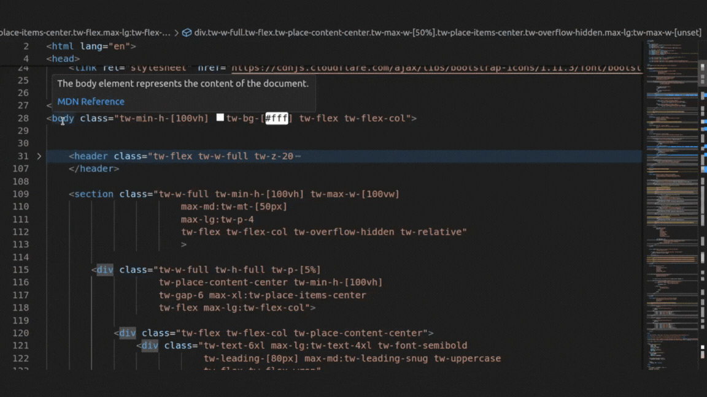

# Hover preview - VsCode extension [BETA] 
This is a simple vscode extension used for previewing your html elements while hovering.
Currently made for html files only.

>[!NOTE]
This is still in beta, currently this extension will create a temp file in your working directory to render the html (called `.hoverpreview.temp.html`), we'll soon change that. Please refer to [roadmap](roadmap.md)

## Why use Hover preview?

Have you seen a code like this and gone, what does this even do???

well now you don't, cause hover preview will show you exactly what that renders in browser

## Roadmap

Please refer to [roadmap](roadmap.md) 

## Features
* Preview on hover
* Coming soon...

## Extension Settings

Coming soon!

## Release Notes

This is the first version of the extension. Feel free to test it. Pretty soon 

### 1.0.0 [beta]

Current release

### Extra

* Oh! don't forget to 🌟 [star this repo](https://github.com/PaulleDemon/Hover-Preview) for updates.

* Thanks for visiting Hover Preview, enjoy your free [landing page templates](https://github.com/PaulleDemon/landing-pages)

**Enjoy!**

---

## License
License held by Paul, Github: PaulleDemon, Dev.to: https://dev.to/paul_freeman

The source code is under AGPL license, this doesn't affect the end user. 

